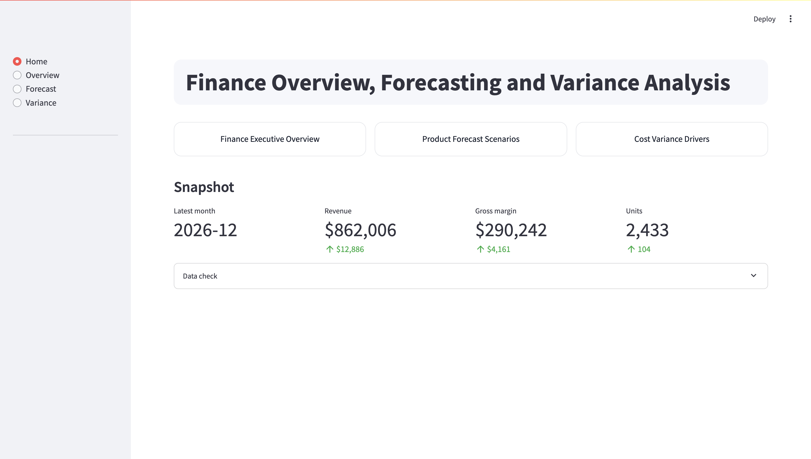
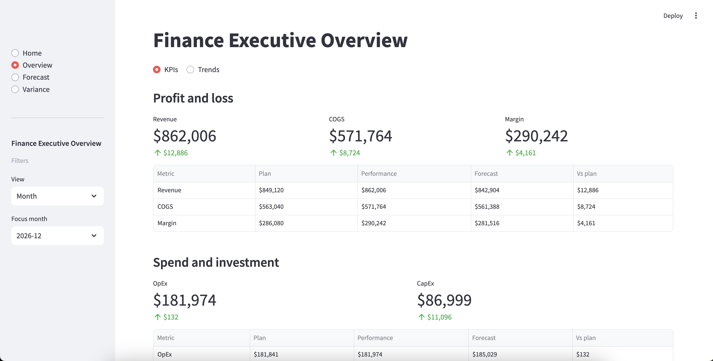
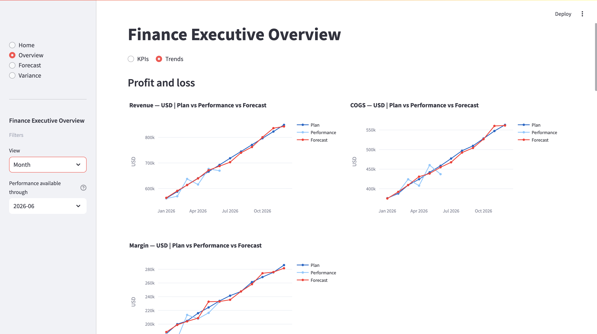
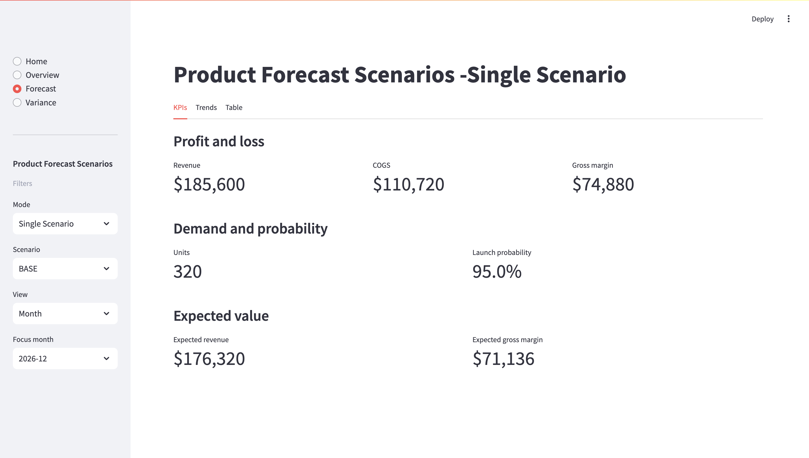
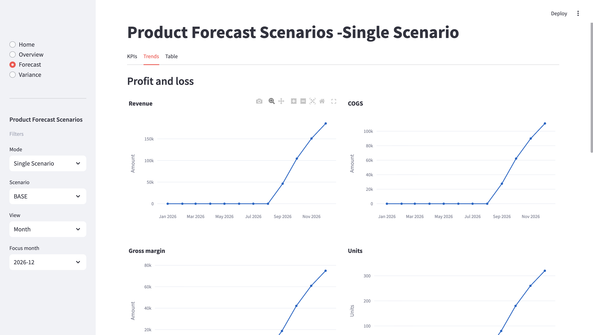
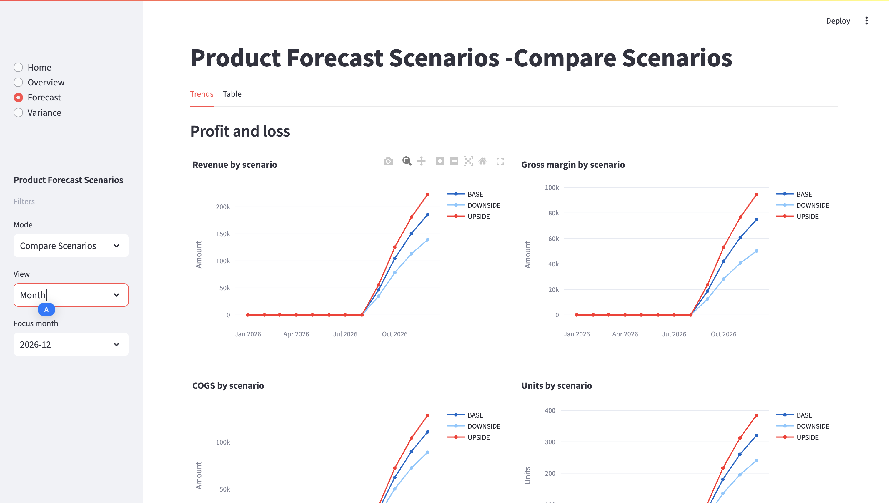
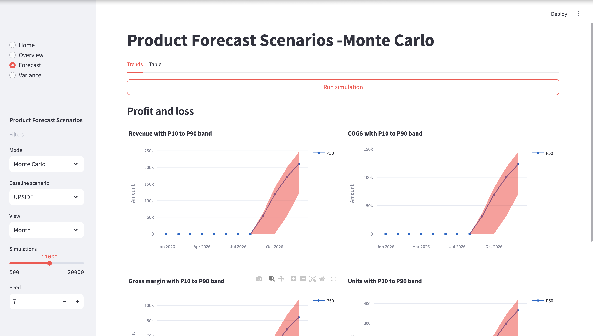
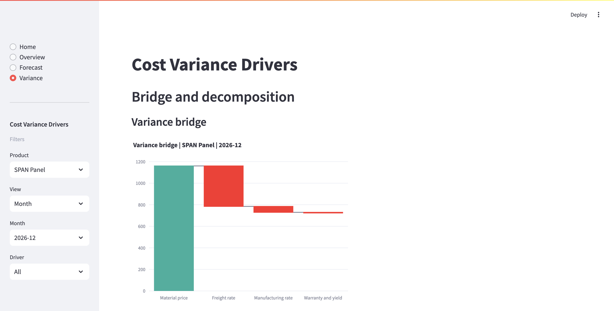
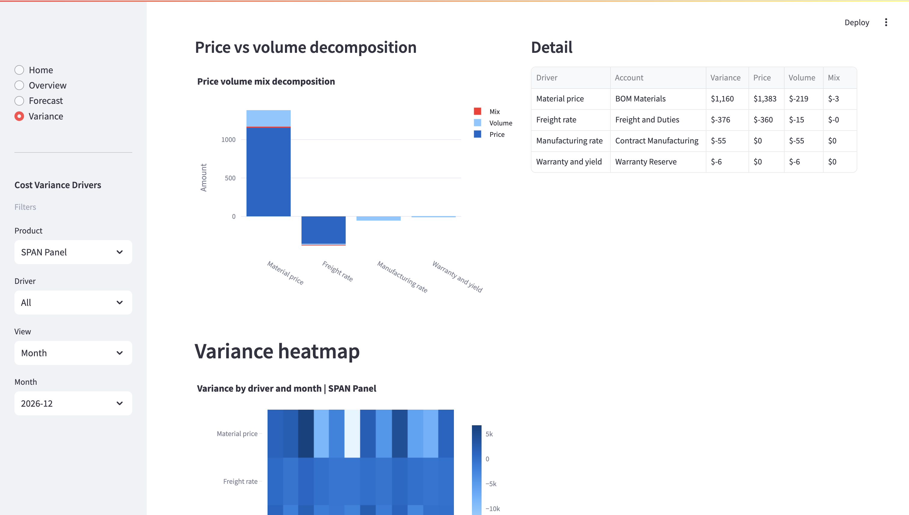

# Finance Overview, Forecast, and Variance Suite

A **interactive** finance dashboard. It’s designed to be **repeatable**, update the input CSVs, refresh the app, and re-use the same views for monthly/quarterly/yearly reviews.

---

## Home

From the Home page, you can click the three buttons to jump directly to:
- **Overview**
- **Forecast**
- **Variance**

---

## Overview

The **Overview** page helps you quickly understand business performance at different time granularities.

What you can do:
- Choose a **View** level: **Month / Quarter / Year**
- Switch between **KPIs** and **Trends** to see summary metrics or time-series patterns

 

---

## Forecast

The Forecast page focuses on scenario-based planning for new products, with built-in support for working through **ambiguous** inputs.

Modes:
- **Single Scenario**: deep dive into one scenario
- **Compare Scenarios**: compare multiple scenarios side-by-side
- **Monte Carlo**: simulate uncertainty using user-defined input distributions, and **run simulations** by adjusting parameters.

Scenarios available:
- **Base**
- **Downside**
- **Upside**

You can also:
- Choose a **View** level: **Month / Quarter / Year**
- Switch between **KPIs** and **Trends** to view summary numbers or trends

 
 

---

## Variance

The **Variance** page explains cost variance drivers and helps you drill down from high-level variance to detailed contributors.

Filters:
- **Product**: select **All** or a specific product
- **Driver**: select **All** or a specific driver
- **View** level: **Month / Quarter / Year**

This page is useful for understanding:
- Which drivers explain the variance
- How variance decomposes (e.g., price vs volume)
- Which accounts contribute the most

 